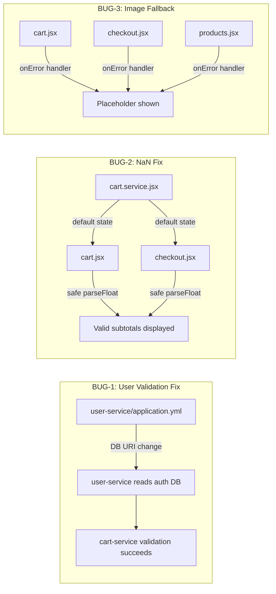

# Enhancement Impact Plan — Purely Cart Bug Fix

## Enhancement Scope

Three bug fixes impacting backend configuration, frontend state management, and frontend image rendering.

| Bug | ID | Scope | Severity |
|---|---|---|---|
| User Validation Failure (Cart API 404) | BUG-1 | Backend config | Critical |
| NaN Values in Cart UI | BUG-2 | Frontend | High |
| Broken External Image URLs | BUG-3 | Frontend | Medium |

## Impacted Modules

### BUG-1: User Validation Failure

| Module | File | Change Type | Description |
|---|---|---|---|
| user-service (config) | `microservice-backend/user-service/src/main/resources/application.yml` | **Modify** | Change MongoDB URI from `purely_user_service` to `purely_auth_service` so user-service reads from the same database where auth-service writes user records |

**Rationale**: The simplest, lowest-risk fix is to point `user-service` at the same MongoDB database used by `auth-service`. Both services operate on the same User domain entity. In local development, there is no replication or event-sourcing layer — direct database sharing is the intended pattern.

**Alternative considered**: Adding a Feign call from `cart-service` directly to `auth-service` to validate users — rejected because it bypasses the existing service boundary and adds coupling.

### BUG-2: NaN Values in Cart UI

| Module | File | Change Type | Description |
|---|---|---|---|
| Cart component | `frontend/src/components/cart/cart.jsx` | **Modify** | Add safe numeric formatting with fallback to `0.00` for `amount` and `subtotal` |
| Checkout page | `frontend/src/pages/checkout/checkout.jsx` | **Modify** | Add safe numeric formatting with fallback to `0.00` for `amount` and `subtotal` |
| Cart service hook | `frontend/src/api-service/cart.service.jsx` | **Modify** | Initialize cart state with default numeric fields; ensure error fallback includes `subtotal: 0` |

### BUG-3: Broken External Image URLs

| Module | File | Change Type | Description |
|---|---|---|---|
| Cart component | `frontend/src/components/cart/cart.jsx` | **Modify** | Add `onError` handler to `` tags with placeholder fallback |
| Checkout page | `frontend/src/pages/checkout/checkout.jsx` | **Modify** | Add `onError` handler to `` tags with placeholder fallback |
| Products page | `frontend/src/pages/products/products.jsx` | **Modify** | Add `onError` handler to `` tags with placeholder fallback |

## Dependency Diff

No new dependencies are required. All fixes use existing libraries and capabilities:
- Spring Boot MongoDB configuration (existing)
- React event handlers (`onError`) — built-in
- JavaScript number handling — built-in

## Impact Diagram

## Rollout Order

| Step | Bug | Action | Prerequisite |
|---|---|---|---|
| 1 | BUG-1 | Modify `user-service/application.yml` MongoDB URI | None |
| 2 | BUG-1 | Restart `user-service` and verify cart API returns 200 | Step 1 |
| 3 | BUG-2 | Update `cart.service.jsx` default state and error fallback | None |
| 4 | BUG-2 | Add safe numeric formatting in `cart.jsx` and `checkout.jsx` | Step 3 |
| 5 | BUG-3 | Add `onError` image fallback handlers in `cart.jsx`, `checkout.jsx`, `products.jsx` | None |

Steps 1-2 (BUG-1) and steps 3-5 (BUG-2 + BUG-3) are independent and can be developed in parallel.

## Regression Safeguards

| Area | Risk | Safeguard |
|---|---|---|
| `user-service` DB change | Other user-service queries may break if data model differs | Verify both services use the same `User` model (both are `@Document` with same fields) |
| Cart state initialization | Existing code that reads `cart.cartItems` | Ensure default state includes `cartItems: []` (already present in error handler) |
| `parseFloat` guards | Changing display logic may affect non-NaN values | Use conditional guard: only default when value is falsy or NaN — pass through valid numbers as-is |
| Image `onError` handler | May fire repeatedly for the same broken URL | Set placeholder via `e.target.src` only if `src` differs from placeholder to avoid infinite loop |

## Risk Mitigation

| Risk | Likelihood | Impact | Mitigation |
|---|---|---|---|
| `user-service` and `auth-service` have different User model schemas | Low | High | Inspect both `User` models before applying fix — both use MongoDB `@Document` with similar fields |
| Product images may ALL be broken (no valid external URLs) | Medium | Low | Placeholder fallback handles this gracefully; also verify sample data URLs |
| Cart API may have other failure modes beyond user validation | Low | Medium | The NaN fix handles all downstream display issues regardless of API error cause |

## Files Changed Summary

| File | Bugs Addressed | Change Scope |
|---|---|---|
| `microservice-backend/user-service/src/main/resources/application.yml` | BUG-1 | Config (1 line) |
| `frontend/src/api-service/cart.service.jsx` | BUG-2 | State init + error fallback |
| `frontend/src/components/cart/cart.jsx` | BUG-2, BUG-3 | Safe format + image fallback |
| `frontend/src/pages/checkout/checkout.jsx` | BUG-2, BUG-3 | Safe format + image fallback |
| `frontend/src/pages/products/products.jsx` | BUG-3 | Image fallback |

**Total files modified**: 5
**Total files added**: 0
**Total files deleted**: 0
