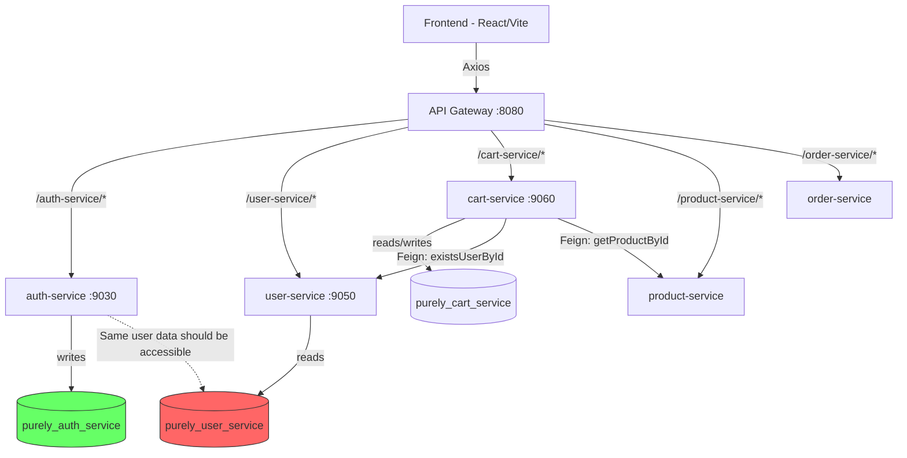

# Existing Project Analysis — Purely E-Commerce Platform

## Project Identity

| Field | Value |
|---|---|
| Name | Purely |
| Repository | https://github.com/workguysummitgrp/purely |
| Type | Full-stack e-commerce platform |
| Architecture | Microservices (Spring Boot backend) + SPA (React frontend) |
| Package Namespace | `com.dharshi` |

## Tech Stack

### Backend
- **Language**: Java 17+
- **Framework**: Spring Boot 3.x with Spring Cloud
- **Build Tool**: Maven (wrapper: `mvnw`)
- **Service Discovery**: Spring Cloud Netflix Eureka
- **Inter-service Communication**: Spring Cloud OpenFeign
- **API Gateway**: Spring Cloud Gateway (port 8080)
- **Database**: MongoDB (per-service isolation pattern)
- **Security**: Spring Security + JWT (custom `AuthTokenFilter`)
- **Containerisation**: Docker (per-service Dockerfiles)
- **Orchestration**: Helm Charts + Terraform (EKS)

### Frontend
- **Language**: JavaScript (JSX)
- **Framework**: React 18
- **Build Tool**: Vite
- **Routing**: React Router v6
- **HTTP Client**: Axios
- **Forms**: react-hook-form
- **State Management**: React Context API
- **Container**: Docker + Nginx

### Infrastructure
- **IaC**: Terraform (VPC, EKS, ECR, ALB)
- **K8s Packaging**: Helm Charts (per-service)
- **Container Runtime**: Docker

## Architecture / Module Inventory

### Backend Microservices

| Service | Port | Database | Purpose |
|---|---|---|---|
| `service-registry` | 8761 | — | Eureka discovery server |
| `api-gateway` | 8080 | — | Spring Cloud Gateway, routes `/api/*` to services |
| `auth-service` | 9030 | `purely_auth_service` | User registration, login, JWT issuance, email verification |
| `user-service` | 9050 | `purely_user_service` | User existence checks, user profile lookups |
| `cart-service` | 9060 | `purely_cart_service` | Cart CRUD, validates users via Feign to user-service |
| `product-service` | — | — | Product CRUD, search |
| `category-service` | — | — | Product categories |
| `order-service` | — | — | Order placement, order history |
| `notification-service` | — | — | Email notifications (registration verification) |

### Frontend Modules

| Module | Path | Purpose |
|---|---|---|
| API Services | `frontend/src/api-service/` | Axios-based service hooks (auth, cart, product, order) |
| Contexts | `frontend/src/contexts/` | React Context providers (auth, cart) |
| Components | `frontend/src/components/` | Reusable UI (cart drawer, header, footer, loading, info) |
| Pages | `frontend/src/pages/` | Route-level pages (auth, checkout, home, products, search, my.account) |
| Routes | `frontend/src/routes/` | React Router configuration |

## Dependency Map (Bug-Relevant)

```
auth-service ──writes──▶ purely_auth_service (MongoDB)
user-service ──reads───▶ purely_user_service (MongoDB)  ← DATA MISMATCH
cart-service ──Feign───▶ user-service (existsUserById)
cart-service ──Feign───▶ product-service (getProductById)
frontend     ──Axios───▶ api-gateway ──routes──▶ cart-service
frontend     ──Axios───▶ api-gateway ──routes──▶ auth-service
```

## Module Dependency Diagram



## Tech Debt Assessment

1. **Database split between auth-service and user-service**: The two services share a logical "User" domain entity but use separate MongoDB databases. In production this could be intentional (CQRS/event-sourcing pattern) but no sync mechanism exists. In local dev, it causes immediate data inconsistency.
2. **No null safety in frontend numeric rendering**: `parseFloat()` is called on potentially `undefined` values throughout cart and checkout components with no guards.
3. **No image error handling**: All `` tags trust external URLs without fallback.
4. **Cart context initial state**: `useState({})` provides no type safety; downstream components assume `subtotal` and `cartItems` exist.
5. **Inconsistent error handling in cart service hook**: Error fallback sets `{cartItems:[]}` but omits `subtotal`, `cartId`, and other fields the UI expects.

## Risk Hotspots

| Risk | Area | Impact |
|---|---|---|
| MongoDB data inconsistency | `user-service` ↔ `auth-service` | Blocks all cart operations |
| Unsafe `parseFloat` calls | `cart.jsx`, `checkout.jsx` | NaN displayed to users |
| Missing image fallback | `cart.jsx`, `checkout.jsx`, `products.jsx` | Broken UI images |
| Feign call failure cascade | `cart-service` → `product-service` | Null product data → NPE in `cartItemToCartItemResponseDto` |
