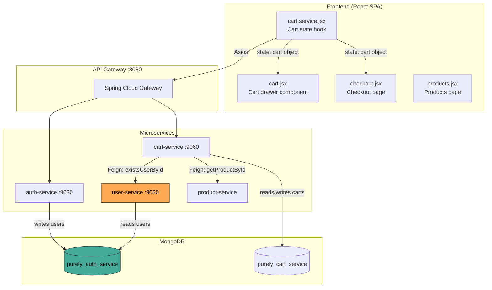
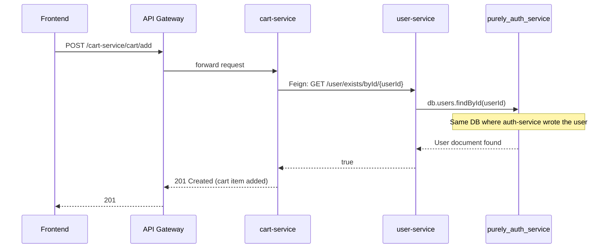
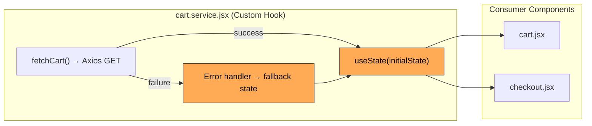
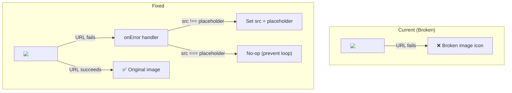

# Architecture Document — Purely Cart Bug Fix

## 1. Scope

This document describes the architectural context and targeted changes for three bug fixes affecting the Purely e-commerce platform. All fixes operate **within the existing microservice architecture** — no new services, components, or external dependencies are introduced.

**Jira Epic**: PURELY-1
**Work Type**: Bug Fix (Enhancement — Mode 3)
**Affected Stories**: PURELY-16 (US-001), PURELY-17 (US-002), PURELY-18 (US-003), PURELY-19 (US-004), PURELY-20 (US-005), PURELY-21 (US-006), PURELY-22 (US-007)

---

## 2. Current Architecture Overview

### 2.1 System Context

Purely is a full-stack e-commerce platform built on a microservices backend with a React SPA frontend. All client traffic enters through a Spring Cloud Gateway that routes to individual services registered via Eureka.

```mermaid
C4Context
    title System Context — Purely E-Commerce

    Person(user, "Customer", "Browses products, manages cart, places orders")
    System(frontend, "React SPA", "Vite + React 18 + Axios")
    System(gateway, "API Gateway", "Spring Cloud Gateway :8080")
    System(eureka, "Service Registry", "Eureka :8761")

    System_Boundary(services, "Microservices") {
        System(auth, "auth-service :9030")
        System(userSvc, "user-service :9050")
        System(cart, "cart-service :9060")
        System(product, "product-service")
        System(category, "category-service")
        System(order, "order-service")
        System(notif, "notification-service")
    }

    SystemDb(mongo, "MongoDB", "Per-service databases")

    Rel(user, frontend, "HTTPS")
    Rel(frontend, gateway, "Axios → REST")
    Rel(gateway, auth, "route: /auth-service/*")
    Rel(gateway, userSvc, "route: /user-service/*")
    Rel(gateway, cart, "route: /cart-service/*")
    Rel(gateway, product, "route: /product-service/*")
    Rel(gateway, order, "route: /order-service/*")
    BiRel(eureka, services, "service discovery")
    Rel(services, mongo, "MongoDB driver")
```

### 2.2 Service Interaction — Bug-Relevant Paths

The three bugs sit at the intersection of three architectural layers:

1. **Backend configuration layer** — MongoDB connection URIs per service
2. **Inter-service communication layer** — Feign client calls
3. **Frontend state management layer** — React Context + hooks



---

## 3. Bug-Specific Architectural Analysis

### 3.1 BUG-1: Database Configuration Architecture — PURELY-16 (US-001), BRD-001, FRD-001

#### Root Cause

The existing architecture follows a **per-service database isolation** pattern where each microservice owns its MongoDB database. However, `auth-service` and `user-service` both operate on the **same domain entity (User)** without a synchronization mechanism.

| Service | Current Database | Correct Database |
|---|---|---|
| auth-service | `purely_auth_service` [existing] | `purely_auth_service` [no change] |
| user-service | `purely_user_service` [existing — **misconfigured**] | `purely_auth_service` [modified] |

#### Architectural Impact

The fix aligns `user-service` to read from the same MongoDB database (`purely_auth_service`) where `auth-service` writes user records. This is architecturally valid because:

- Both services share an identical `User` `@Document` model with the same fields
- `user-service` performs **read-only** operations (`existsUserById`, profile lookups)
- `auth-service` performs **write** operations (registration, email verification)
- This creates a natural **read/write split** on the same datastore — not a violation of service boundaries

#### Service Interaction Flow (Fixed)



#### Boundary Preservation

- No new Feign clients or service endpoints are added
- No schema migrations required — both services already use the same document model
- Service boundary is preserved: `user-service` remains the owner of user-read operations
- Only `application.yml` configuration changes — zero code changes in `user-service`

---

### 3.2 BUG-2: Frontend State Management Architecture — PURELY-17 (US-002), PURELY-18 (US-003), PURELY-19 (US-004), BRD-002, FRD-002–004

#### Root Cause

The frontend uses a **React Context + custom hook** pattern for cart state. The hook (`cart.service.jsx`) initializes state as an empty object `{}` and the error fallback omits required fields. Downstream components call `parseFloat()` on missing fields, producing `NaN`.

#### State Flow Architecture



#### Fix Architecture

The fix operates at two levels:

1. **State initialization** (defensive layer 1): Set default numeric values (`subtotal: 0`, `cartItems: []`) in both the initial state and error fallback in `cart.service.jsx`
2. **Rendering guards** (defensive layer 2): Apply safe numeric formatting inline in `cart.jsx` and `checkout.jsx` that returns `"0.00"` for `undefined`/`null`/`NaN` inputs

This **dual-layer defense** ensures correct rendering even if the API returns unexpected shapes:

```
API Response → cart.service.jsx (layer 1: safe defaults) → component render (layer 2: safe format)
```

#### Component API Preservation

No component props or public interfaces change. The fixes are purely internal to each component's render logic and to the hook's state initialization. Parent components continue to use the same hook API.

---

### 3.3 BUG-3: Image Rendering Architecture — PURELY-20 (US-005), PURELY-21 (US-006), PURELY-22 (US-007), BRD-003, FRD-005–007

#### Root Cause

Product image URLs stored in MongoDB may reference external hosts that are unreachable (404/403). The existing `` elements have no error handling.

#### Image Loading Architecture



#### Pattern: Inline onError Handler

The fix uses React's native `onError` prop on `` elements, which is the simplest and most idiomatic React approach. Each affected component gets the same handler pattern:

```jsx
onError={(e) => {
  if (e.target.src !== PLACEHOLDER_IMAGE) {
    e.target.src = PLACEHOLDER_IMAGE;
  }
}}
```

The guard `e.target.src !== PLACEHOLDER_IMAGE` prevents infinite `onError` → `src` reassignment loops (NFR-005).

#### Affected Components

| Component | File | Image Sources | Jira Key |
|---|---|---|---|
| Cart drawer | `frontend/src/components/cart/cart.jsx` | Cart item product images | PURELY-20 |
| Checkout page | `frontend/src/pages/checkout/checkout.jsx` | Order summary product images | PURELY-21 |
| Products page | `frontend/src/pages/products/products.jsx` | Product listing card images | PURELY-22 |

---

## 4. Architecture Constraints (Enhancement)

All constraints from the `analyzeHandoff` are preserved:

| ID | Constraint | Architectural Implication |
|---|---|---|
| C-1 | No architecture changes | No new services, endpoints, or communication patterns |
| C-2 | MongoDB per-service isolation preserved in production | Local dev shares DB; production can maintain separate DBs with a sync mechanism |
| C-3 | No new external dependencies | Zero `package.json` / `pom.xml` changes |
| C-4 | Component APIs unchanged | Props and hook interfaces remain stable |
| C-5 | localhost + Eureka + Gateway setup | Fixes verified against local development environment |

---

## 5. Security Boundaries

No security boundaries are affected by these fixes:

- **JWT authentication flow** remains unchanged — auth-service issues tokens, gateway validates them
- **Feign inter-service calls** continue to use the existing service-to-service trust model (no auth between internal services)
- **MongoDB access** remains service-side only — no direct DB access from the frontend
- **Image fallback** uses a local placeholder asset — no new external resource loading

---

## 6. Deployment Architecture Impact

| Concern | Impact |
|---|---|
| New services deployed | None |
| New containers / pods | None |
| Configuration changes | `user-service/application.yml` only |
| Restart scope | `user-service` restart only (NFR-006) |
| Database migrations | None |
| Frontend rebuild | Yes — standard Vite rebuild for JS changes |
| Helm chart changes | None |
| Terraform changes | None |

---

## 7. Traceability

| Architecture Section | BRD | FRD | NFR | Stories (Jira) |
|---|---|---|---|---|
| 3.1 Database Configuration | BRD-001 | FRD-001 | NFR-003, NFR-006 | PURELY-16 |
| 3.2 Frontend State Management | BRD-002 | FRD-002, FRD-003, FRD-004 | NFR-001, NFR-004 | PURELY-17, PURELY-18, PURELY-19 |
| 3.3 Image Rendering | BRD-003 | FRD-005, FRD-006, FRD-007 | NFR-002, NFR-005 | PURELY-20, PURELY-21, PURELY-22 |
