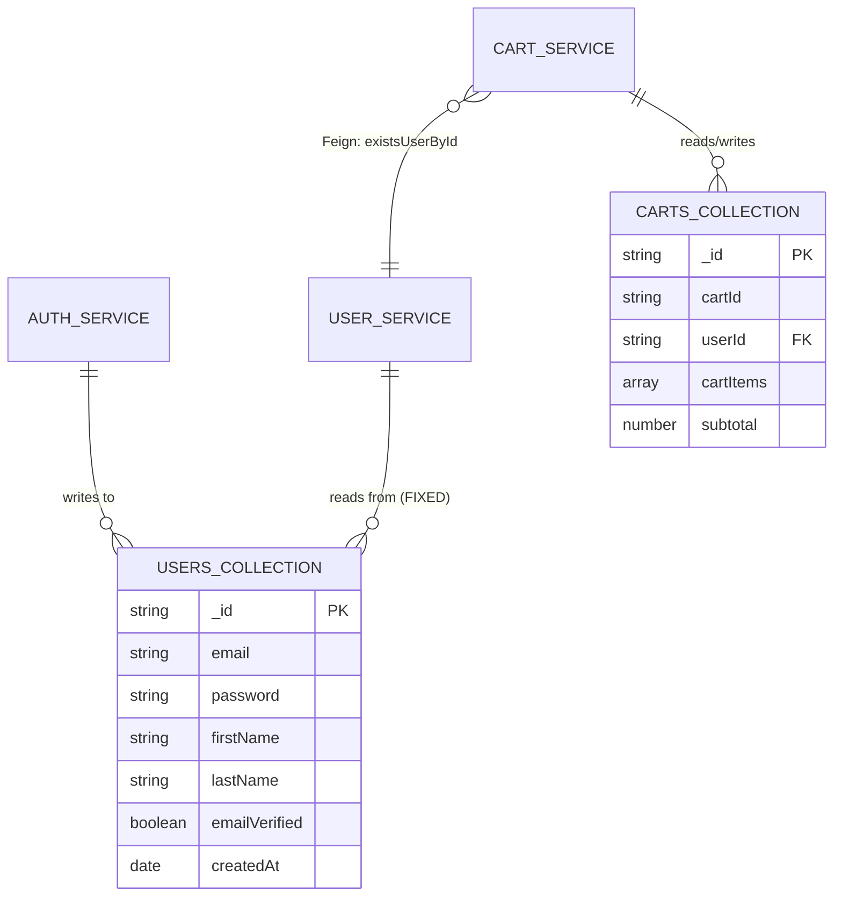
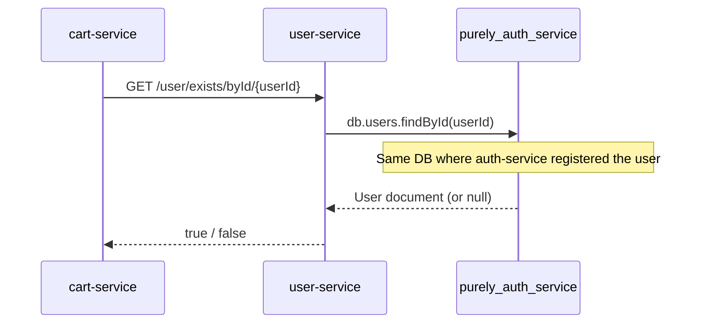

# Data Model Document — Purely Cart Bug Fix

## 1. Scope

This document covers data model changes and clarifications for the bug-fix enhancement. No new entities are created. Changes are limited to:
- MongoDB database configuration (BUG-1)
- Frontend cart state shape (BUG-2)
- Frontend image URL handling (BUG-3)

All existing entities are marked `[existing]`. Only modified aspects are detailed.

---

## 2. Backend Data Model — MongoDB Configuration Change

### 2.1 Database Alignment — PURELY-16 (US-001) / BRD-001

#### Current Configuration (Broken)

| Service | Database | Collection | Purpose |
|---|---|---|---|
| auth-service | `purely_auth_service` | `users` | User registration, login, JWT | [existing] |
| user-service | `purely_user_service` | `users` | User existence checks, profile lookups | [existing — **misconfigured**] |
| cart-service | `purely_cart_service` | `carts` | Cart CRUD | [existing] |

**Problem**: `auth-service` writes user records to `purely_auth_service`. `user-service` reads from `purely_user_service` (empty). `cart-service` calls `user-service.existsUserById()` via Feign → always returns `false` → 404.

#### Fixed Configuration

| Service | Database | Collection | Purpose |
|---|---|---|---|
| auth-service | `purely_auth_service` | `users` | User registration, login, JWT | [existing] |
| user-service | `purely_auth_service` | `users` | User existence checks, profile lookups | **[modified]** |
| cart-service | `purely_cart_service` | `carts` | Cart CRUD | [existing] |

**Change**: `user-service` `application.yml` MongoDB URI changed from `purely_user_service` to `purely_auth_service`.

#### Data Flow Diagram



> **Note**: Both `auth-service` and `user-service` share the same `User` `@Document` model with identical fields. No schema migration is needed.

### 2.2 User Validation Data Flow — PURELY-16 (US-001)



---

## 3. Frontend Data Model — Cart State Shape

### 3.1 Cart State Object — PURELY-17 (US-002) / BRD-002

#### Current State Shape (Broken)

```javascript
// Initial state — no defaults
const [cart, setCart] = useState({})
// → cart.cartItems = undefined
// → cart.subtotal = undefined

// Error fallback — incomplete
setCart({ cartItems: [] })
// → cart.subtotal = undefined → NaN when formatted
```

#### Fixed State Shape

```javascript
// Initial state — safe defaults
const [cart, setCart] = useState({
  cartItems: [],
  subtotal: 0
})

// Error fallback — complete
setCart({
  cartItems: [],
  subtotal: 0
})
```

### 3.2 Cart State Schema

| Field | Type | Default | Required | Description |
|---|---|---|---|---|
| `cartId` | `string \| undefined` | `undefined` | No | Server-assigned cart ID (populated after first API success) |
| `cartItems` | `CartItem[]` | `[]` | Yes | Array of cart line items |
| `subtotal` | `number` | `0` | Yes | Sum of all item amounts |

### 3.3 CartItem Schema [existing]

| Field | Type | Nullable | Description |
|---|---|---|---|
| `productId` | `string` | No | Product identifier |
| `productName` | `string` | No | Display name |
| `imageUrl` | `string` | Yes | External product image URL — may be stale/broken |
| `price` | `number` | Yes | Unit price |
| `quantity` | `number` | No | Quantity in cart (1–20) |
| `amount` | `number \| undefined` | Yes | `price × quantity` — may be `undefined` if API returns incomplete data |

### 3.4 Cart API Response Schema [existing]

Response from `GET /cart-service/cart/get/byUser`:

```json
{
  "response": {
    "cartId": "abc123",
    "userId": "user456",
    "cartItems": [
      {
        "productId": "prod789",
        "productName": "Organic Almonds",
        "imageUrl": "https://external-cdn.example.com/almonds.jpg",
        "price": 250,
        "quantity": 2,
        "amount": 500
      }
    ],
    "subtotal": 500
  }
}
```

**Known issue**: If `product-service` is unreachable when building the cart response, `cartItemToCartItemResponseDto` in `cart-service` may produce items with `null` image, price, or amount fields. The frontend safe formatting handles this gracefully.

---

## 4. Image URL Data Model

### 4.1 Image URL Sources [existing]

| Context | Field Path | Source | Example |
|---|---|---|---|
| Cart item | `cartItem.imageUrl` | Resolved from `product-service` at cart-build time | `https://cdn.example.com/product.jpg` |
| Product card | `product.imageUrl` | Product catalog entry | `https://cdn.example.com/product.jpg` |

### 4.2 Image Fallback Constant — PURELY-20 (US-005), PURELY-21 (US-006), PURELY-22 (US-007) / BRD-003

| Constant | Value | Location |
|---|---|---|
| `PLACEHOLDER_IMAGE` | `"/placeholder-product.png"` | Local asset in `frontend/public/` |

Used in `onError` handler:

```
if (e.target.src !== window.location.origin + PLACEHOLDER_IMAGE) {
  e.target.src = PLACEHOLDER_IMAGE;
}
```

---

## 5. Data Model Relationship Diagram (Bug-Fix Scope)

```mermaid
graph TD
    subgraph Backend
        AUTH_DB[(purely_auth_service<br>users collection)]
        CART_DB[(purely_cart_service<br>carts collection)]
        AUTH[auth-service] -->|writes| AUTH_DB
        USER[user-service] -->|reads FIXED| AUTH_DB
        CART[cart-service] -->|Feign| USER
        CART -->|reads/writes| CART_DB
    end

    subgraph Frontend State
        CART_STATE[cart state<br>cartItems: CartItem[]<br>subtotal: number]
        SAFE_FMT[safeFormatPrice<br>utility]
        PLACEHOLDER[PLACEHOLDER_IMAGE<br>constant]
    end

    CART -->|API response| CART_STATE
    CART_STATE -->|amount, subtotal| SAFE_FMT
    CART_STATE -->|imageUrl| PLACEHOLDER
```

---

## 6. Traceability Matrix

| Data Element | Bug | Stories | Change Type |
|---|---|---|---|
| `user-service` MongoDB URI | BUG-1 | PURELY-16 (US-001) | Config value change |
| `cart` initial state shape | BUG-2 | PURELY-17 (US-002) | Default values added |
| `cart` error fallback shape | BUG-2 | PURELY-17 (US-002) | `subtotal: 0` added |
| `cartItem.amount` display | BUG-2 | PURELY-18 (US-003), PURELY-19 (US-004) | Safe formatting applied |
| `cart.subtotal` display | BUG-2 | PURELY-18 (US-003), PURELY-19 (US-004) | Safe formatting applied |
| `cartItem.imageUrl` rendering | BUG-3 | PURELY-20 (US-005), PURELY-21 (US-006) | `onError` fallback added |
| `product.imageUrl` rendering | BUG-3 | PURELY-22 (US-007) | `onError` fallback added |
| `PLACEHOLDER_IMAGE` constant | BUG-3 | PURELY-20–22 (US-005–007) | New constant (local asset path) |
