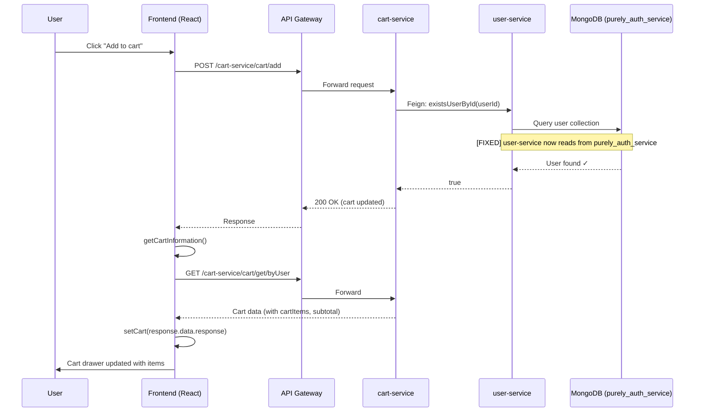
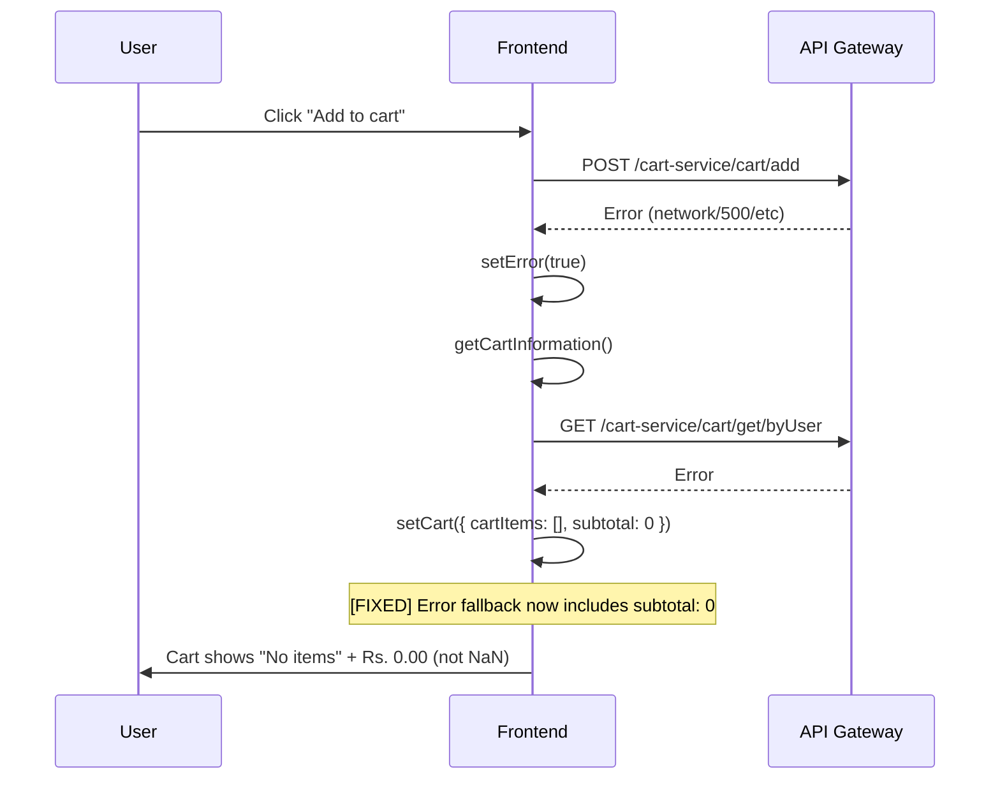

# Interaction Design Document — Purely Cart Bug Fix

## 1. Scope

This document defines interaction patterns affected by the three bug fixes. Only modified or new interactions are documented. All other interactions remain unchanged and are marked `[existing]`.

---

## 2. User Flows

### 2.1 Add to Cart Flow [existing — modified]

**Stories**: PURELY-16 (US-001), PURELY-17 (US-002)



**Before fix**: Step `US→DB` queried `purely_user_service` (empty) → returned `false` → `cart-service` returned 404 → `FE` set error state.

**After fix**: `user-service` reads from `purely_auth_service` where user records exist → validation succeeds → cart operation completes.

#### Error Path — Cart API Failure



### 2.2 Cart Rendering Flow [existing — modified]

**Stories**: PURELY-17 (US-002), PURELY-18 (US-003), PURELY-20 (US-005)

#### Interaction: Cart Drawer Opens

| Step | Trigger | Action | Result |
|---|---|---|---|
| 1 | User clicks cart icon | Cart drawer slides in (`shoppingCart active`) | [existing] |
| 2 | `isProcessingCart` is true | `<Loading />` shown | [existing] |
| 3 | Cart data received | Items rendered in `.cart-products` | [existing] |
| 4 | `cartItem.amount` rendered | `safeFormatPrice(cartItem.amount)` called | **[new]** Returns `"0.00"` if undefined/NaN |
| 5 | `cart.subtotal` rendered | `safeFormatPrice(cart.subtotal)` called | **[new]** Returns `"0.00"` if undefined/NaN |
| 6 | `` element loads | Browser fetches `cartItem.imageUrl` | [existing] |
| 7a | Image loads successfully | Product image displayed | [existing] |
| 7b | Image fails to load | `onError` fires → `src` set to placeholder | **[new]** |
| 7c | Placeholder also fails | Guard check: `src === placeholder` → no action | **[new]** Loop prevention |

#### Interaction: Quantity Change

| Step | Trigger | Action | Result |
|---|---|---|---|
| 1 | Click `+` or `-` button | `onQuantityChange(productId, ±1)` | [existing] |
| 2 | API call completes | `getCartInformation()` refreshes cart | [existing] |
| 3 | New amounts rendered | `safeFormatPrice()` applied to all values | **[new]** Safe formatting |

#### Interaction: Remove Item

| Step | Trigger | Action | Result |
|---|---|---|---|
| 1 | Click delete icon (🗑) | `onProductRemove(productId)` | [existing] |
| 2 | API call completes | Cart refreshed | [existing] |
| 3 | If cart becomes empty | `!cart.cartItems` → "No items" message | [existing] |
| 4 | Subtotal updates | `safeFormatPrice(cart.subtotal)` | **[new]** May show `"0.00"` |

### 2.3 Checkout Page Flow [existing — modified]

**Stories**: PURELY-19 (US-004), PURELY-21 (US-006)

#### Interaction: Order Summary Rendering

| Step | Trigger | Action | Result |
|---|---|---|---|
| 1 | Checkout page mounts | Cart data read from `CartContext` | [existing] |
| 2 | `cartItems.map()` renders items | Each item's amount formatted safely | **[new]** `safeFormatPrice()` |
| 3 | Subtotal rendered | `safeFormatPrice(cart.subtotal)` | **[new]** |
| 4 | `` elements load | Image URLs fetched | [existing] |
| 5a | Image success | Product image shown | [existing] |
| 5b | Image failure | `onError` → placeholder | **[new]** |

#### Interaction: Place Order [existing — unchanged]

Form submission, validation, and order placement flows are unaffected. No changes.

### 2.4 Product Browse Flow [existing — modified]

**Stories**: PURELY-22 (US-007)

#### Interaction: Product Card Image Loading

| Step | Trigger | Action | Result |
|---|---|---|---|
| 1 | Products page mounts | Product list fetched and rendered | [existing] |
| 2 | `` element created per product | Browser fetches `product.imageUrl` | [existing] |
| 3a | Image loads | Product image displayed in card | [existing] |
| 3b | Image fails | `onError` → placeholder image | **[new]** |
| 3c | Placeholder fails | Guard prevents re-trigger | **[new]** |

#### Interaction: Add to Cart from Products Page [existing — modified]

| Step | Trigger | Action | Result |
|---|---|---|---|
| 1 | Click "Add to cart" on product card | `onAddToCart(productId)` | [existing] |
| 2 | If not logged in | Navigate to `/auth/login` | [existing] |
| 3 | If logged in | `addItemToCart(productId, 1)` | [existing] |
| 4 | User validation | user-service checks `purely_auth_service` | **[fixed]** PURELY-16 (US-001) |
| 5 | Success | Cart updated, loading state cleared | [existing] |

---

## 3. Image Error Handling Interaction Pattern

**Stories**: PURELY-20 (US-005), PURELY-21 (US-006), PURELY-22 (US-007)

This is a reusable interaction pattern applied identically across cart, checkout, and products.

### State Machine

```
[Initial] ──img.src set──▶ [Loading]
[Loading] ──onLoad──▶ [Displayed] (terminal)
[Loading] ──onError──▶ [Fallback Check]
[Fallback Check] ──src ≠ placeholder──▶ [Set Placeholder] ──▶ [Loading]
[Fallback Check] ──src = placeholder──▶ [Failed] (terminal — no further action)
```

### Interaction Details

| Event | Handler | Guard | Action |
|---|---|---|---|
| `onError` | `handleImageError(e)` | `e.target.src !== PLACEHOLDER_PATH` | `e.target.src = PLACEHOLDER_PATH` |
| `onError` | `handleImageError(e)` | `e.target.src === PLACEHOLDER_PATH` | No-op (prevent infinite loop) |

### User-Visible Behavior

- **No flash of broken icon**: The `onError` fires before the broken-image icon renders in most browsers, so users see the placeholder directly.
- **No retry**: Once a placeholder is set, the original URL is not retried. Page reload resets.
- **No toast/notification**: Image failures are handled silently. No user-facing error message for broken images.

---

## 4. Numeric Formatting Interaction Pattern

**Stories**: PURELY-17 (US-002), PURELY-18 (US-003), PURELY-19 (US-004)

### State Machine

```
[Value Received] ──value is valid number──▶ [Format: parseFloat(value).toFixed(2)]
[Value Received] ──value is undefined/null/NaN──▶ [Format: "0.00"]
```

### Interaction Details

| Scenario | Input | Output | Component |
|---|---|---|---|
| Valid amount | `500` | `"500.00"` | cart.jsx, checkout.jsx |
| Undefined amount | `undefined` | `"0.00"` | cart.jsx, checkout.jsx |
| Null amount | `null` | `"0.00"` | cart.jsx, checkout.jsx |
| NaN from API | `NaN` | `"0.00"` | cart.jsx, checkout.jsx |
| String amount | `"12.5"` | `"12.50"` | cart.jsx, checkout.jsx |
| Zero amount | `0` | `"0.00"` | cart.jsx, checkout.jsx |

### User-Visible Behavior

- Users never see `NaN`, `undefined`, or blank values in price fields.
- `Rs. 0.00` is shown as a safe fallback — better than `NaN` for trust.
- No additional visual indicator (e.g., warning icon) for defaulted values. The zero itself is the indicator.

---

## 5. Cart State Initialization Interaction

**Stories**: PURELY-17 (US-002)

### Before Fix

```
Component Mount → useState({}) → cart = {}
  → cart.cartItems = undefined → "No items" shown (OK)
  → cart.subtotal = undefined → parseFloat(undefined) → NaN displayed (BUG)
```

### After Fix

```
Component Mount → useState({ cartItems: [], subtotal: 0 }) → cart = { cartItems: [], subtotal: 0 }
  → cart.cartItems = [] → "No items" shown (OK)
  → cart.subtotal = 0 → "Rs. 0.00" displayed (OK)

API Error → setCart({ cartItems: [], subtotal: 0 })
  → Same safe display
```

---

## 6. Interaction Summary by Jira Story

| Story | US ID | Interaction Change | Type |
|---|---|---|---|
| PURELY-16 | US-001 | user-service queries correct DB; cart API succeeds | [existing — modified] |
| PURELY-17 | US-002 | Cart state initializes with safe defaults | [new] |
| PURELY-18 | US-003 | Cart drawer uses `safeFormatPrice()` for amounts/subtotal | [new] |
| PURELY-19 | US-004 | Checkout page uses `safeFormatPrice()` for amounts/subtotal | [new] |
| PURELY-20 | US-005 | Cart drawer images have `onError` fallback | [new] |
| PURELY-21 | US-006 | Checkout page images have `onError` fallback | [new] |
| PURELY-22 | US-007 | Products page images have `onError` fallback | [new] |
